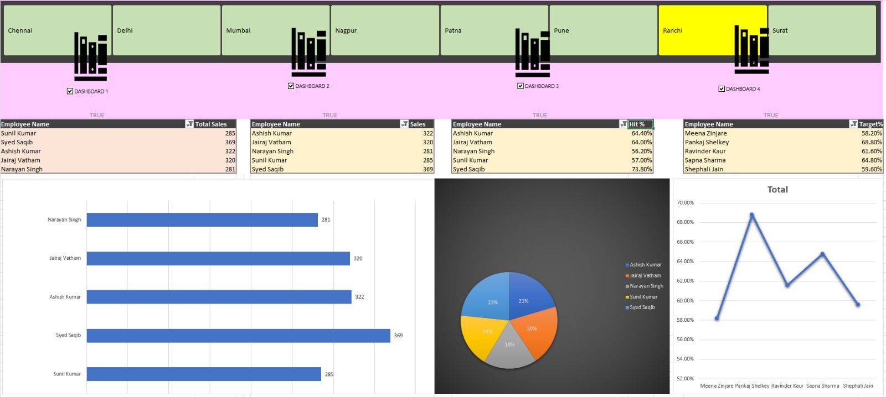

# 📊 Excel Sales Dashboard

## Project Overview
This project demonstrates an **end-to-end sales analysis dashboard built in Microsoft Excel** using pivot tables, charts, and macros.

The dashboard helps analyze sales performance across different regions and sales executives.

---

## Tools Used
- Microsoft Excel
- Pivot Tables
- Pivot Charts
- Dashboard Design
- Excel Macros

---

## Dataset Features
The dataset includes:

- Employee Code
- Sales Executive
- Region
- Daily Sales
- Total Sales
- Target
- Target Achievement %

---

## Dashboard Features

✔ Region-wise filtering  
✔ Sales executive performance comparison  
✔ Target achievement analysis  
✔ Interactive charts  

---

## Dashboard Preview



---

## Files Included

```
sales-dashboard-excel-project.xlsm
```

---

## Author

**Ishit Setia**

